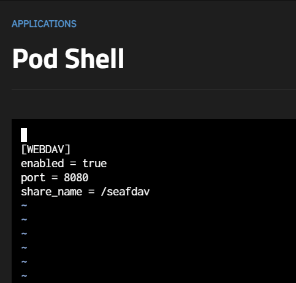

# Seaile installation notes and guidelines

## Ingress

Our install requires a FQDN or domain name entered when installing the chart. This doesn't mean you need Traefik however we support only installs using FQDN with valid certificates + Traefik installed

## Storage

Seafile uses Block storage so files/folders uploaded to Seafile aren't visible by default when mounting the persisted storage. For more information see the this [post](https://forum.seafile.com/t/maintain-file-name-after-upload/11190/3) on the Seafile Forums. As well, Seafile uses init scripts which need to be run as `root` so if `hostpath` is used (such as using HDDs) then make sure your storage is owned by `root`.

## WebDAV

By default WebDAV is disabled by default, as per [upstream docs](https://manual.seafile.com/extension/webdav/). Here's some simple instructions to modify your `seafdav.conf` to enable WebDAV if you wish to use it with Traefik.

- Enter Seafile Pod Shell

- Use the CLI to enter the Seafile WebDAV (`seafdav.conf`) config file

- Use vi commands to edit the `Enabled` to `true` and change the share name as desired (default is `/seafdav`).

> Use `i` to insert text and and `:wq`, and `ESC key` to exit insert mode

- Restart Seafile and your WebDAV share will be accessible using your domain.com/seafdav

## FUSE Extension

The FUSE extension isn't supported by default due to privileges required by the extension and non-standard mounts, so no support tickets will be accepted for using/enabling it.
